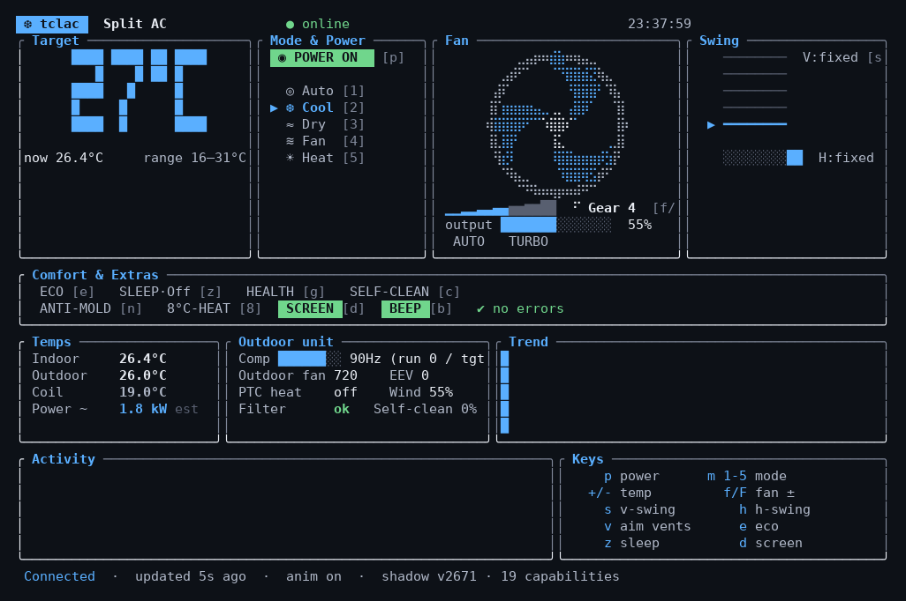
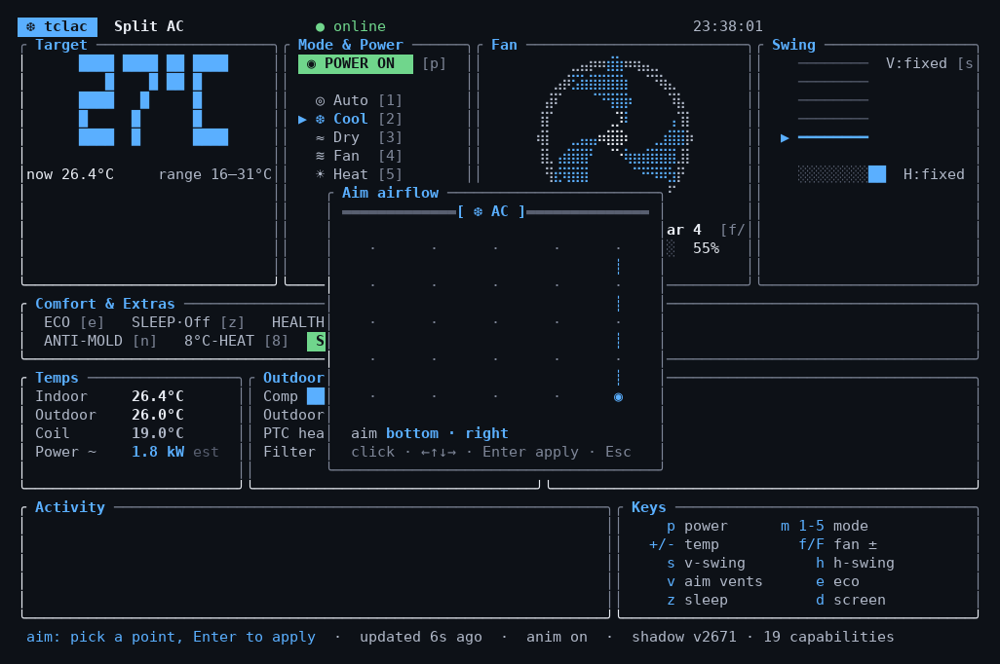

# tclac

CLI/TUI to control a **TCL Home** smart air conditioner over the internet, from your terminal.



It talks to TCL's cloud the same way the phone app does (reverse-engineered):
`login → cloud_url_get → refresh_tokens → Cognito credentials → AWS IoT device shadow`.
Reads live state with `GetThingShadow`; sends commands with `UpdateThingShadow`
(`$aws/things/{id}/shadow/update`). No local network / LAN access to the AC is needed —
it works from anywhere, exactly like the app.

Tested target: TCL Split AC (e.g. `18T3-PRO`). Other TCL device types (portable, window,
dehumidifier) use different command dialects and aren't wired up yet.

## Install

Requires stable [Rust](https://rustup.rs) ≥ 1.94 (the AWS SDK needs it — `rustup update stable` if older).

```bash
# straight from GitHub
cargo install --git https://github.com/AnnanKhan/tclac

# or from a clone
git clone https://github.com/AnnanKhan/tclac
cd tclac
cargo install --path .
```

Both install `tclac` to `~/.cargo/bin` (on `PATH` with a standard rustup setup) — then
run `tclac` from anywhere. For a local build without installing:
`cargo build --release` → `./target/release/tclac`.

## Credentials

Provide your **TCL Home app** email + password one of three ways (checked in order):

1. Environment variables:
   ```bash
   export TCL_USERNAME='you@example.com'
   export TCL_PASSWORD='your-password'
   export TCL_DEVICE_ID='...'   # optional; defaults to the first device
   ```
2. Config file `~/.config/tclac/config.toml` (chmod 600):
   ```toml
   username = "you@example.com"
   password = "your-password"
   # device_id = "xxxxxxxx"   # optional
   ```
3. Interactive prompt (password is not echoed). It offers to save to the config file.

Credentials are only sent to TCL's own login endpoint (`pa.account.tcl.com`), never anywhere else.

## Usage

```bash
tclac                 # launch the interactive TUI dashboard
tclac status          # print current state (--json for machine output)
tclac on              # power on   (also: off / power toggle)
tclac temp 22         # set target °C   (also: temp +1 / temp -2)
tclac mode cool       # auto|cool|dry|fan|heat
tclac fan turbo       # auto|1..6|turbo
tclac vent right top  # fix the vanes at one of 5×5 aim points
tclac telemetry       # live sensors: compressor, coil, outdoor unit, filter
tclac energy          # monthly kWh + runtime from TCL's stats API
tclac list            # list the ACs on the account
tclac help
```

There are two front-ends sharing the same core:

- **TUI** (`tclac` with no args) — the animated dashboard.
- **Scriptable CLI** (`tclac <verb>`) — one-shot commands with `--json` output,
  session caching, and stable exit codes. Built for shell scripts and agents;
  full reference in [AGENTS.md](AGENTS.md).

### TUI keys

| Key   | Action                        | Key   | Action                  |
|-------|-------------------------------|-------|-------------------------|
| `p`   | toggle power                  | `m` / `1`–`5` | cycle / direct mode |
| `+`/`-` (or ↑/↓) | target temp ±1 °C  | `f`/`F` | fan gear up / down    |
| `s`   | vertical swing toggle         | `h`   | horizontal swing toggle |
| `v`   | **aim airflow** (see below)   | `e`   | ECO                     |
| `z`   | sleep cycle (Off/Standard/Elderly/Child) | `d` | screen/display    |
| `b`   | beep                          | `g`   | health mode             |
| `c`   | self-clean                    | `n`   | anti-mold               |
| `8`   | 8 °C heating                  | `a`   | toggle animations       |
| `r`   | refresh now                   | `q` / Esc | quit                |

The dashboard shows big target-temp digits, mode-colored theming (cool = blue,
heat = red, dry = amber, fan = green, auto = purple), an animated fan + swing
sweep (toggle with `a`), sensors (indoor/outdoor/coil temps, compressor Hz,
wind output %), an indoor-temperature sparkline, a timestamped activity log
(including changes made from the phone app), and a full key reference.

State auto-refreshes every 10 s and after each command. Expired cloud credentials
are re-authenticated automatically.

### Aim airflow

Press `v` for a targeting square — the room as seen from the AC. Click anywhere
(mouse is captured) or move the crosshair with arrows and press Enter, and the
vanes are fixed at the matching position. The hardware supports 5 positions per
axis, so clicks snap to a 5×5 grid. Same thing from the CLI: `tclac vent <h> <v>`.



## Device notes (verified live on an 18T3-PRO, 2026-07)

- Fan uses the **7-gear dialect**: `windSpeed7Gear` (0–7) + `windSpeedAutoSwitch`;
  the classic `windSpeed` scheme is kept as a fallback for other models.
- Temperature limits come from the device shadow (`lower/upperTemperatureLimit`,
  16–31 °C on this unit); `targetFahrenheitTemp` is mirrored on every temp change.
- `workMode` mapping `Auto=0, Cool=1, Dry=2, Fan=3, Heat=4` observed consistent
  (`workMode:1` while cooling). Raw value shown in-UI if it ever maps to nothing.

## Layout

```
src/
  main.rs     entry point, arg parsing, device selection
  config.rs   credential loading (env / file / prompt)
  auth.rs     the 5-stage cloud auth chain
  rest.rs     signed REST calls (md5 sign) — device discovery
  iot.rs      AWS IoT device-shadow read/write (SigV4 via AWS SDK)
  device.rs   state parsing + command (desired-state) builders
  app.rs      TUI state + async event loop
  ui.rs       ratatui rendering
```

Protocol credit: reverse-engineering by
[`nemesa/ha-tcl-home-unofficial-integration`](https://github.com/nemesa/ha-tcl-home-unofficial-integration)
and [`DavidIlie/tcl-home-ac`](https://github.com/DavidIlie/tcl-home-ac).

## License

[GPL-3.0](LICENSE). Unofficial project — not affiliated with or endorsed by TCL.
